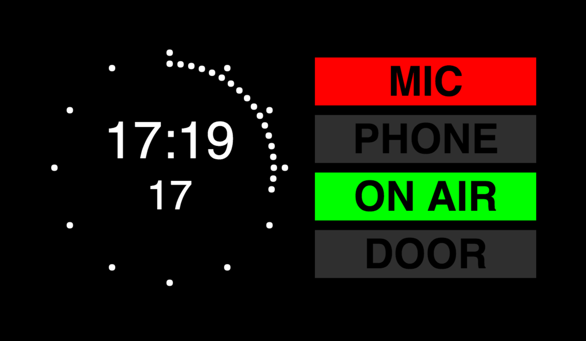

# Studio Clock

A simple browser-based studio clock for radio or television studios.

The indicators can be toggled on or off with the 1-4 number keys on the keyboard.

## Usage

```
git clone git@github.com:rosswilson/studio-clock.git
cd studio-clock
npm install
npm start
```

## Screenshot



## Future Work

- WebSocket connection between multiple clients and the server to sync indicator state.

- REST API to manage indicator state. Supporting integration with audio and vision mixers, Asterisk VoIP server, and door request-entry buttons.

- Re-sync the clock time periodically? Raspberry Pis don't keep time particularly well.

- Ability to add programme title and other details (directors name, studio number)

- Background and colour branding
